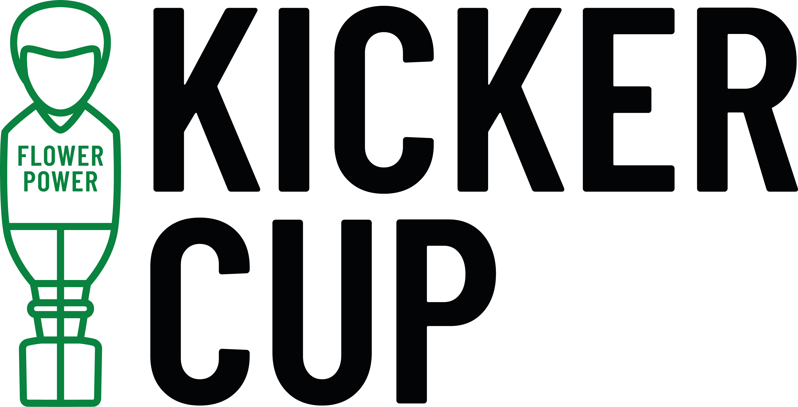

_Dieses Projekt ist Teil der Projektarbeiten des Fachs Programmieren 3 [Programmieren 3 für Wirtschaftsinformatiker]._

# KICKERCUP - Anleitung

## Benutzer anlegen
Ein Benutzerkonto für die Software anlegen oder die in der Application.cs in der Logic hinterlegten Datensätze zum ersten Befüllen der Datenbank nutzen.

## Login
Mit einem registrierten Nutzerkonto anmelden. Von dieser Seite ist auch das Festlegen der Datenbankverbindung über den entsprechend benannten Button möglich. Dies ist nur direkt nach dem Starten des Programmes möglich, sonst wird die standardmäßig angelegte lokale Datenbank genutzt.

## Turnierhistorie
Unter diesem Unterpunkt ist eine Liste aller Turniere des Nutzers inklusive einiger Grunddaten und ihrem Status zu finden. Noch nicht gespielte Turniere können von dieser Seite aus zur Laufzeit gestartet und gespielt werden. Für beendete Turniere kann eine Rangliste mit allen Teilnehmern des ausgewählten Turniers aufgerufen werden.

## Spielen
Ohne weitere Umschweife kann hier direkt ein Turnier angelegt werden, Teilnehmer hinzugefügt und das Turnier gestartet werden. Der Nutzer wird Schritt für Schritt durch die verschiedenen Möglichkeiten geführt. 

* Grunddaten des Turniers festlegen. Dazu gehören der - einzigartige - Turniername, der Spielmodus (ausgewählt werden kann zwischen Double Elimination, Ranked Solo Match und Ranked Team Match) und gegebenenfalls die Anzahl der Sätze, die pro Match gespielt werden sollen, die Anzahl der Tore, die zum Sieg nötig sind, und die Entscheidung, ob die Teilnehmer in diesem Turnier Skillpunkte sammeln sollen oder nicht. Diese Basisdaten werden unter dem Turniernamen in die Datenbank gespeichert. Das Turnier kann also auch erst zu einem späteren Zeitpunkt gestartet werden.

* Teilnehmer hinzufügen. Dies geschieht zur Laufzeit, die Auswahl der Teilnehmer wird also direkt zu Turnierbeginn getroffen. Auf dieser Seite können Teilnehmer aus der Liste ausgewählt werden (lokal angelegte des eingeloggten Nutzers und global angelegte Teilnehmer aller Nutzer des Programms). Außerdem können Teilnehmerdaten auch direkt hier bearbeitet werden oder neue Teilnehmer angelegt werden. Per Klick auf die Pfeile werden die Teilnehmer aus der Gesamtliste in die Turnierliste auf der rechten Seite eingefügt.

* Turnier starten. Das Turnier findet zur Laufzeit statt. Die Teams werden automatisch aufgrund der Skill Level der ausgewählten Teilnehmer zusammengestellt, um möglichst gleich starke Teams zu erzeugen. Auf dem Spielfeld werden die aktuell spielenden Teams angezeigt, sowie ihre jeweiligen, stets aktualisierten Gewinnchancen. Darunter können die Ergebnisse des aktuellen Satzes eingegeben und bestätigt werden. Sobald ein Match zu Ende ist, werden automatisch die Namen der als nächstes gegeneinander spielenden Teams in das Spielfeld geladen.

* Sobald das Turnier beendet ist, erfolgt automatisch die Verkündung des Gewinners.

* Bei "Ranked"-Spielen erfolgt die automatische Berechnung und Aktualisierung des Skill Levels der Teilnehmer auf Grundlage der Turnierergebnisse und der Skill Level des eigenen, sowie des gegnerischen Teams.

## Einstellungen

* Benutzerdaten ändern. Alle Daten des angemeldeten Nutzers können hier aktualisiert werden - die Ausnahme ist der Nutzername, der als Primärschlüssel in der Datenbank nicht zu ändern ist

* Teilnehmermanagement (turnierunabhängig). Hier wird eine Liste aller, dem angemeldeten Nutzer zur Verfügung stehenden, Teilnehmer angezeigt. Dies sind die mit dem Attribut "lokal" gekennzeichneten Teilnehmer des angemeldeten Nutzers, sowie alle als "global" gekennzeichneten Teilnehmer. Auf dieser Seite können neue Teilnehmer angelegt werden oder bestehende Teilnehmer bearbeitet werden. Bei neu angelegten Teilnehmern beträgt der Startwert des Skill Levels automatisch 1500.

* Auch von hier aus kann ein neues Turnier angelegt werden, ohne auf die Startseite zurückkehren zu müssen.

## Features

* Social Media: Teile deine Erfahrung mit unserer Software schnell und einfach auf Facebook & Twitter!

* Feedback: Sende uns ein Feedback! (Zu Testzwecken muss eine eigene E-Mail, an die das Feedback gesendet wird, hinterlegt werden. Nur so kann der Tester die Funktion testen und das Ergebnis überprüfen)
